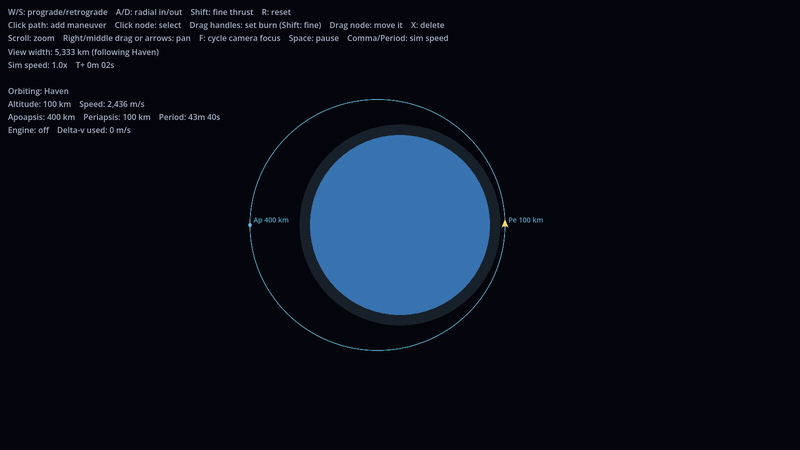

# Orbital Toy

A small 2D orbital mechanics sandbox made in Godot 4.7: a planet, a moon on rails, and a ship you fly with thrust or with chained maneuver nodes. Orbits are exact (Kepler, patched conics), and the predicted trajectory shows moon encounters before they happen.

**Play in your browser:** https://gabrielvotaw.github.io/orbital-toy/

## Controls

| Input | Action |
|---|---|
| W / S | Burn prograde / retrograde |
| A / D | Burn radial in / out |
| Shift | Fine thrust (and fine handle dragging) |
| Click the path | Add a maneuver node |
| Click a node | Select it |
| Drag handles / node | Set the burn / move the node along the path |
| X or Delete | Delete the selected node |
| Space | Pause |
| Comma / Period | Simulation speed |
| Scroll, right-drag, arrows | Zoom and pan |
| F | Cycle camera focus (planet, ship, moon) |
| R | Reset the ship |
| M | Mute / unmute music |

## Running locally

Open `project.godot` in Godot 4.7 and press F5. Tests: `godot --headless --path . res://tests/run_tests.tscn`.

The background music is synthesized by `tools/make_music.py` (needs Python and ffmpeg); rerun it to regenerate `audio/space_ambient.ogg`.
